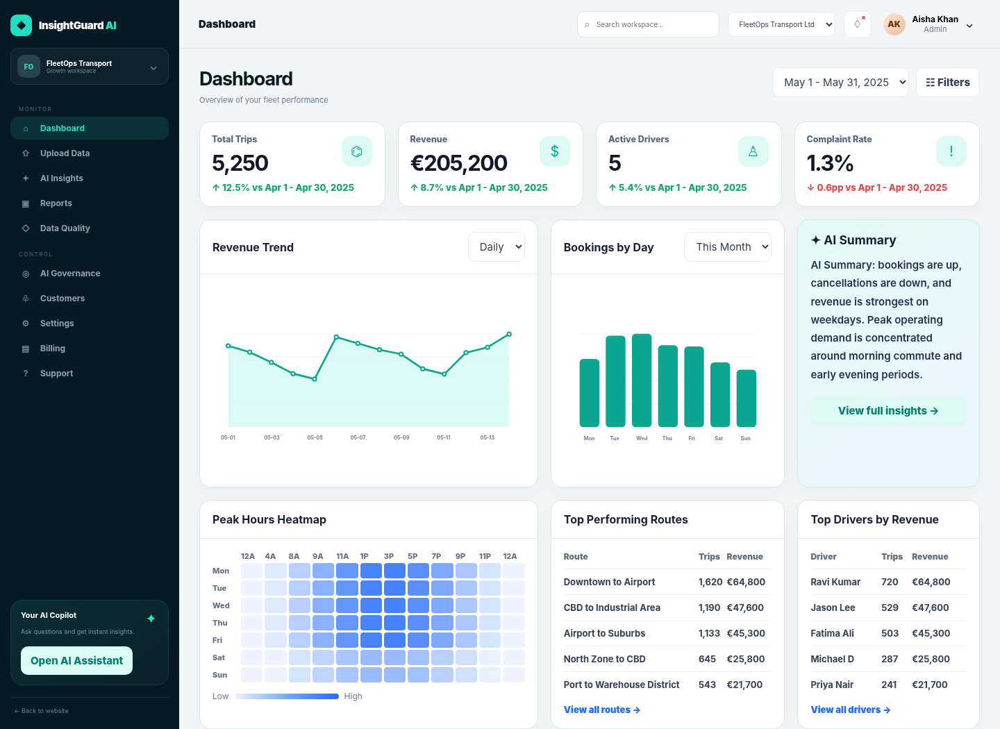

# InsightGuard AI — working product MVP

InsightGuard AI is a responsive, Netlify-ready SaaS prototype for transport and fleet businesses. It combines operational analytics, explainable AI-style insights, data-quality controls, management reporting and AI governance in one clean workspace.

The interface follows a realistic modern product style: white surfaces, cobalt-blue accents, compact navigation, soft shadows, readable charts and business-ready data views.\n\n

## Start locally

The prototype has no build step. You can open `index.html` directly, but a local server gives the most reliable experience.

```bash
python -m http.server 8080
```

Then open `http://localhost:8080`.

## Deploy to Netlify

1. Extract the final ZIP.
2. Open [Netlify Drop](https://app.netlify.com/drop).
3. Drag the complete `insightguard-mvp` folder onto the page.
4. Open the generated HTTPS URL.
5. Test the homepage, live workspace, upload flow and sandbox checkout.

No build command or publish-directory change is required. `netlify.toml`, `_redirects` and `_headers` are already included.

## What works

- Responsive public homepage with product, workflow, governance and pricing sections
- Demo signup and sign-in modals
- Realistic fleet dashboard with KPIs, charts, heatmap, routes and drivers
- CSV upload and in-browser parsing
- Excel upload through SheetJS
- One-click sample dataset
- AI-style operational Q&A and recommendations
- Data-quality scoring and validation views
- Printable management report and CSV export
- AI governance checklist and policy-pack download
- Customer search and creation
- Editable organisation settings
- Billing plans, invoice download and usage summary
- Complete sandbox checkout with card, UPI and invoice modes
- Coupon codes: `FOUNDING20` and `PILOT10`
- Downloadable sandbox receipt
- Browser local-storage persistence
- Responsive desktop, tablet and mobile layouts

## Recommended presentation flow

1. Start on the homepage and explain the four connected capabilities.
2. Select **Explore live demo**.
3. Show the dashboard KPIs, revenue trend and AI summary.
4. Open **Upload Data** and select **Load sample data**.
5. Open **AI Insights** and ask: `What is driving revenue performance?`
6. Open **AI Governance** and show the checklist and policy templates.
7. Open **Billing**, choose a plan and demonstrate sandbox checkout.

See `PRESENTATION_GUIDE.md` for a rehearsable five-minute script.

## Sandbox payment details

- Card number: `4242 4242 4242 4242`
- Expiry: `12/30`
- CVC: `123`
- UPI: `demo@upi`

No real payment is processed and card details are not stored.

## Main files

- `index.html` — homepage, app shell, checkout and modal markup
- `styles.css` — base application layout and components
- `premium.css` — marketing, checkout and advanced component styles
- `reference-theme.css` — final clean blue-and-white visual theme
- `app.js` — dashboard data, navigation, reports and interactions
- `enhancements.js` — homepage, Excel handling, modals and checkout
- `sample_fleet_data.csv` — presentation-ready test dataset
- `payment-config.js` — hook for a future hosted payment provider

## Production boundaries

This is a presentation-quality frontend MVP. A production release still requires:

- Secure authentication and role permissions
- Multi-tenant database and cloud file storage
- Server-side file validation and malware scanning
- A real AI service with monitoring and usage controls
- Secure payment provider checkout and verified webhooks
- Transactional email, logging, backups and security review
- Final privacy, terms and data-retention policies

Never place private API keys or payment secrets in frontend files.

